## Step 2: Explore & summarize project management processes and create a README

In this step you will:

- Explore the process docs in the `docs/` folder (for example, `octoacme-project-planning.md`, `octoacme-roles-and-personas.md`, and `octoacme-risks-and-communication.md`)
- Generate a 3–4 paragraph summary in your Copilot Space (workflows, roles, communication, quality)
- Use that summary to create/attach the existing issue about the README
- Create a pull request adding a README that links all process docs and includes the brief overview

### 📖 Theory: Attaching issues and assigning to the GitHub Copilot Cloud Agent

While reading, note:

- End-to-end workflow stages and handoffs
- Defined roles/personas and responsibilities
- Decision / escalation points
- Communication cadences and channels
- Quality gates, reviews, and acceptance criteria

You will use the prompts below to:

1. Summarize the docs
2. Attach the prior issue
3. Generate a PR adding a docs/ README with links + overview

Proceed to the activities and run the provided prompts in your Copilot Space.

> [!IMPORTANT]
> If you use Copilot Free or want to avoid consuming premium request units, select **Auto**. Requests made with Auto do not consume premium request units. For more information, see [GitHub Copilot plans](https://docs.github.com/en/copilot/get-started/plans#comparing-copilot-plans) and [Copilot billing](https://docs.github.com/en/billing/concepts/product-billing/github-copilot-billing).

### ⌨️ Activity: Explore the project management process docs and Summarize in your Copilot Space

1. Generate a summary. Should be 3-4 paragraphs covering the main processes OctoAcme uses for project management.

   Open your Copilot Space you created in the previous step. https://github.com/copilot/spaces and select **Yours** and select **"OctoAcme Project Management Hub"**

   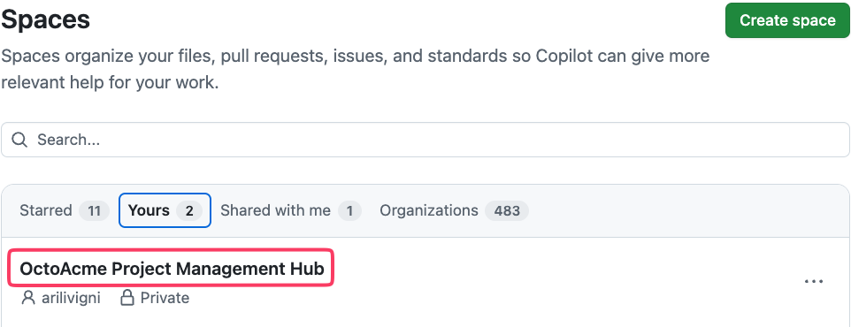

2. Start a new conversation in the Copilot Space and prompt the following:

   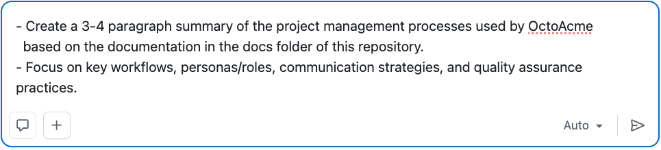

   > 
   >
   > ```prompt
   > - Create a 3-4 paragraph summary of the project management processes used by OctoAcme
   >   based on the documentation in the docs folder of this repository.
   > - Focus on key workflows, personas/roles, communication strategies, and quality assurance practices.
   > ```

   <details>
   <summary> 📷 Show screenshot of the conversation output</summary>

   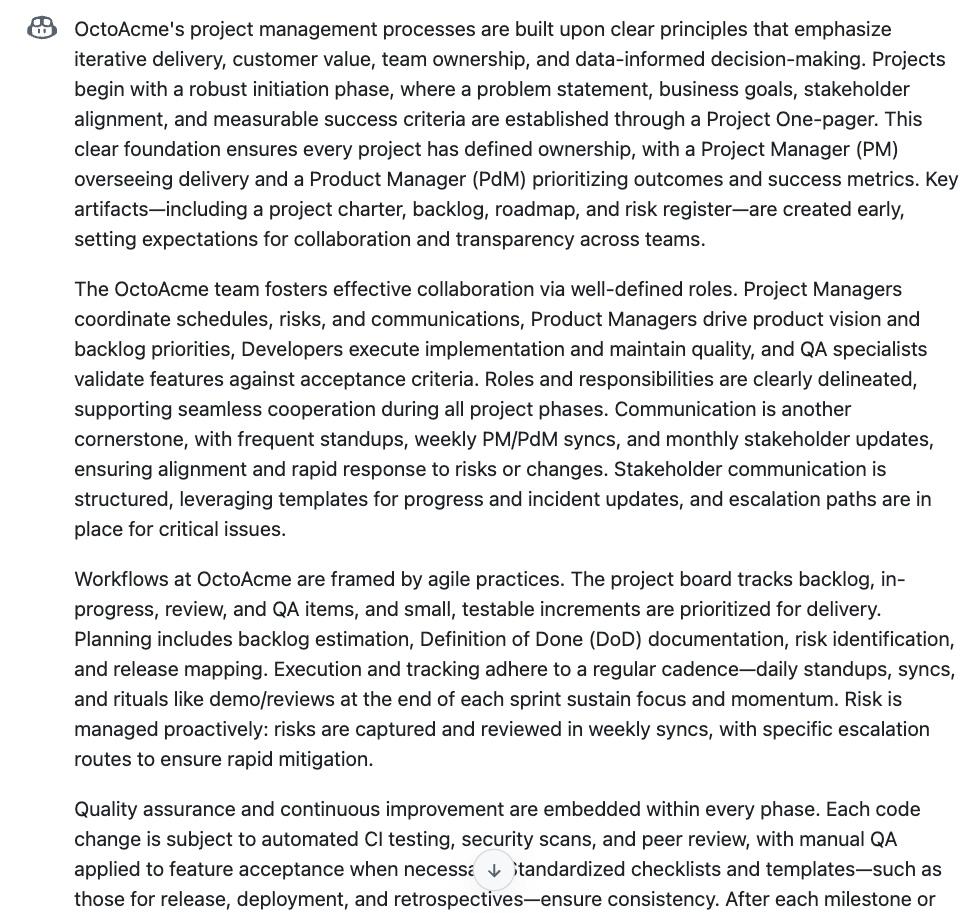

   </details>

### ⌨️ Activity: Attach an issue and create a pull request for the Copilot Cloud Agent

In this activity, you will connect the issue you created in Step 1 to your Copilot Space conversation and use the Copilot Cloud Agent to automatically create a pull request.

1. **Find your issue number**: Go to [https://github.com/{{full_repo_name}}/issues](https://github.com/{{full_repo_name}}/issues) and note the issue number from Step 1 (it should be about creating a README for project management docs)

2. **Attach the issue to your conversation**: In your Copilot Space, type the following (replace `#` with your actual issue number):

> [!IMPORTANT]
> After typing the issue reference below, press **\<SHIFT\> + \<ENTER\>** to add it to the conversation without sending the message yet.

   ```text
   @{{full_repo_name}}/issues/#
   ```

   (Example: if your issue is #2, type `@{{full_repo_name}}/issues/2`)

3. **Verify the issue is attached**: You should see the issue title and details appear in your conversation

4. **Create the pull request**: Now send this prompt to create the pull request:

   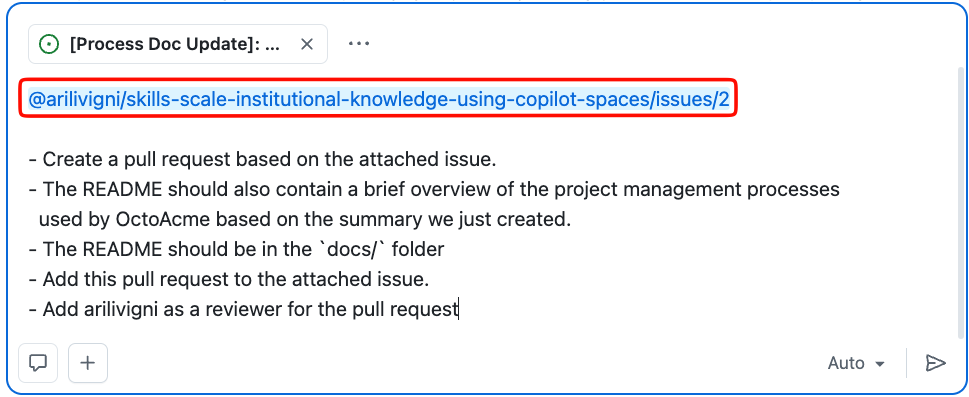

   > 
   >
   > ```prompt
   > - Verify the attached issue is the README issue created in Step 1. Its title should include README, project management processes summary, and links.
   > - If a different issue is attached, stop and do not create a pull request.
   > - Create a pull request based on the attached issue.
   > - The README should also contain a brief overview of the project management processes
   >   used by OctoAcme based on the summary we just created.
   > - The README should be in the `docs/` folder
   > - In the pull request description, add `Closes #<issue-number>`, replacing `<issue-number>` with the attached issue's number.
   > - Add {{login}} as a reviewer for the pull request
   > ```

> [!NOTE]
> If an issue or pull request is not created, click the **Retry** button shown below


5. **Allow the Copilot Cloud Agent**: When prompted, select **Allow** to let the Copilot Cloud Agent work on your repository

   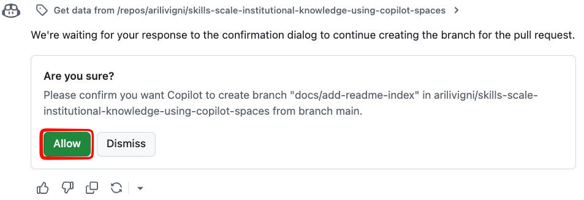

6. **Monitor progress**: You should receive a notification that the Copilot Cloud Agent is working on your pull request.

   There are two ways you can check the status of the Copilot Cloud Agent working on your pull request

   #### Option 1: Check Pull Requests in your repository

   Go to your repository and click **Pull requests** and select the pull request to see the progress:

      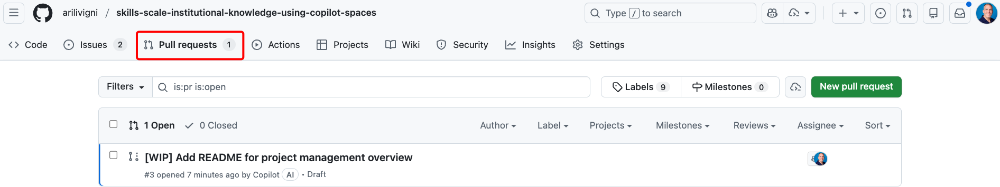

   #### Option 2: Check Agent Sessions in your Copilot Space on the left side under Agent sessions

   You can track the progress of the Copilot Cloud Agent and view details on the left side under **Agent sessions**. Click on the session to see details about the tasks being performed by the agent.

      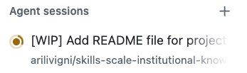

   You can get to the pull request that the agent is working on by clicking the link in the session details at the bottom where it says **View pull request**.

      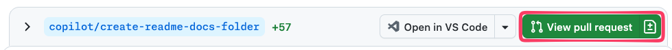

7. **Check open pull requests**: We can check pull request status from our **Copilot Space** as well.

   > 
   >
   > ```prompt
   > check open pull requests
   > ```

   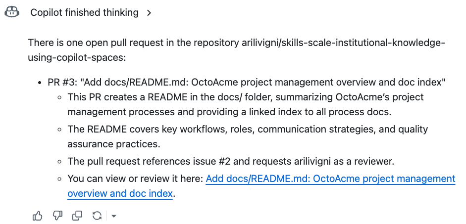

   Click the link to the pull request in the Copilot Space to view the PR details and monitor the Copilot Cloud Agent's progress.

> [!NOTE]
> The Copilot Cloud Agent typically takes 5-15 minutes to complete the work. If you want to track the work that the Copilot Cloud Agent is doing from within the pull request, click **View session** 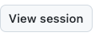 to watch the progress if desired.

8. **Review and merge**: Once the pull request is ready:

   a. **Submit review**: Leave a comment (optional), click **Approve**, then **Submit review**

      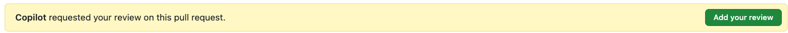

      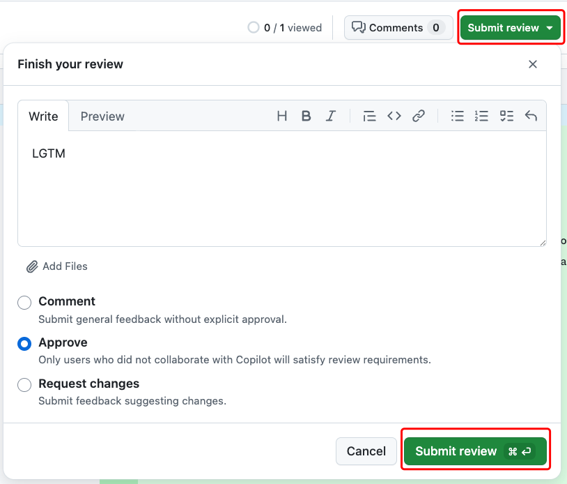

   b. **Merge**: Select **Ready for review**, then **Merge pull request** and **Confirm merge**

      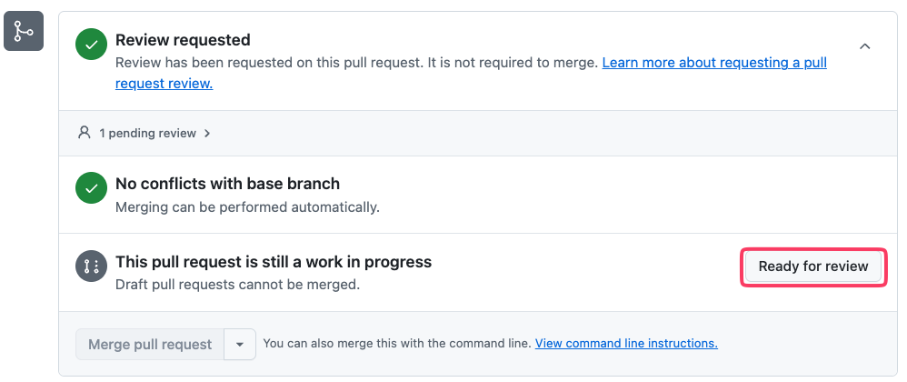
      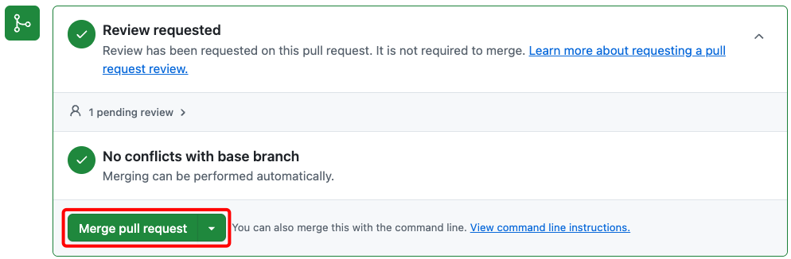

   c. **Confirm issue closure**: Open the issue linked from the pull request and verify that GitHub marked it **Closed** after the pull request merged.

<details>
<summary>Having trouble? 🤷</summary>

- **Can't find your issue?** Check the [Issues tab](https://github.com/{{full_repo_name}}/issues) in your repository for the issue you created in Step 1
- **Issue not attaching?** Make sure you're using the exact format `@{{full_repo_name}}/issues/#` where `#` is your issue number
- **Copilot Cloud Agent not working?** Ensure you have the necessary permissions to create pull requests in your repository
- **Pull request creation failed?** The issue must be properly attached before the Copilot Cloud Agent can work on it
- **Step didn't advance after merging?** The check runs automatically when the pull request is merged into `main`. Give it a moment, then open the [Actions tab](https://github.com/{{full_repo_name}}/actions) to confirm the **Step 2** run completed. No manual approval is required

</details>
